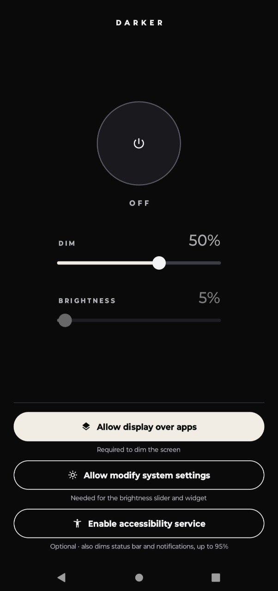

# Darker

A minimalist Android screen dimmer. Darker draws a black, semi-transparent layer over the screen so you can go below the minimum system brightness. Touches pass straight through the layer, so you keep using your phone normally.

<p align="center">
  
</p>

## Features

- **One-tap on/off.** A big power button, with a dim slider and a system brightness slider.
- **Home-screen widgets:**
  - **Dim level** (4×1): − / bar / +
  - **Brightness** (4×1): − / bar / + for the system screen brightness
  - **Dim button** (1×1): on/off toggle
  - **Darker (all)** (4×2): all of the above in one widget
- **Quick Settings tile.** Toggle dimming from the notification shade.
- **Optional accessibility mode.** It also dims the status bar and notification shade, and allows dimming up to 95%.
- **No ads, no network, no data collection.**

## Permissions

| Permission | Why | Required |
|---|---|---|
| Display over other apps | Draws the dimming layer | Yes, unless accessibility mode is on |
| Modify system settings | Brightness slider and Brightness widget | Optional |
| Accessibility service | Dims the system bars too and allows up to 95% dimming. It receives events only from Darker itself and never reads screen content | Optional |
| Notifications | Shows the ongoing "Darker is on" notification with a Turn off button | Optional |

The app shows a setup button for each permission that is missing. Each button disappears once its permission is granted.

### Notes

- On **Android 12+**, a regular overlay is limited to 80% opacity. Above that, Android blocks touches from passing through it. Use accessibility mode, or lower the brightness, to go darker.
- On **Android 13+**, if you install the APK by opening the file on the phone, the accessibility toggle may be greyed out as a *Restricted setting*. Enable it under **App info → ⋮ → Allow restricted settings**.

## Build

Requires Android 8.0+ (API 26). Built with the Android Gradle Plugin 9 and Kotlin.

```bash
./gradlew assembleDebug
```

The APK is written to `app/build/outputs/apk/debug/`.

## License

See [LICENSE](LICENSE).
